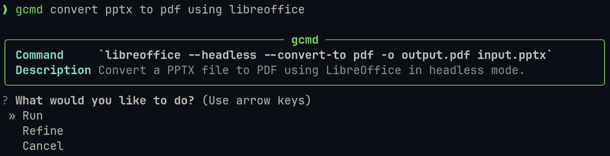

# gcmd (Generate Command)

Generate and run bash commands from natural language descriptions using a local LLM via Ollama.

## Demo



## What it does

Describe what you want to do in plain English, and gcmd will generate the appropriate bash command, show you what it does, and let you run it or refine it. Other tools exist like this, but this one is fully designed for local Ollama models.

```bash
gcmd find all pdf files larger than 10MB in my home directory
```

## Installation

1. Install dependencies:
```bash
pip install ollama questionary rich
```

2. Install [Ollama](https://ollama.com) and pull your preferred model (default: `llama3.2:3b`):
```bash
ollama pull llama3.2:3b
```

3. Install globally (optional but recommended):
```bash
chmod +x gcmd.py
sudo ln -s "$(pwd)/gcmd.py" /usr/local/bin/gcmd
```

## Configuration

On first run, a config file is created at `~/.config/gcmd/config.json`:

```json
{
  "model": "llama3.2:3b"
}
```

Edit this file to use a different Ollama model.

## Usage

```bash
gcmd <describe your task>
```

After the command is generated, you can:
- **Run** - execute the command in your shell
- **Refine** - add more context to get a better command
- **Cancel** - exit without running

## Suggested Improvements

### Code
- **Copy to clipboard**: Add a "Copy" option alongside "Run/Refine/Cancel" using `pyperclip`
- **Command history**: Store generated commands with timestamps in `~/.local/share/gcmd/history.json`
- **Dry-run safety**: Add optional confirmation prompt before running destructive commands (rm, mv with overwrite, etc.)
- **Shell detection**: Auto-detect user's shell instead of hardcoding `zsh`
- **Error handling**: Catch Ollama connection errors and show helpful message ("Is Ollama running?")

### Documentation
- **Quick install**: Add a one-liner install command or `setup.py`/`pyproject.toml` for `pip install`
- **Model recommendations**: List tested models and performance notes
- **Example gallery**: More concrete examples with expected output
- **FAQ**: Common issues like "Ollama isn't responding" or "Model not found"
